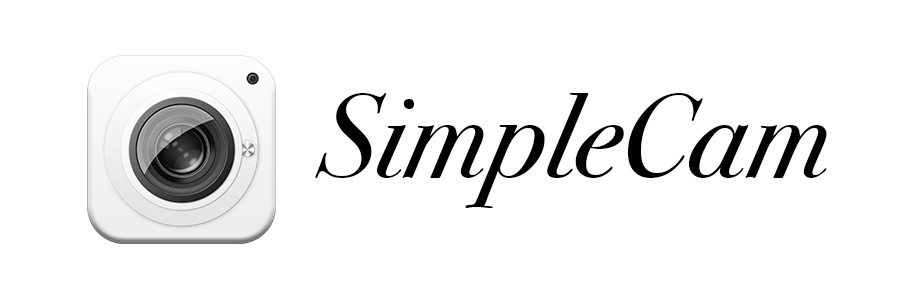

# 简介

本项目是基于 GPUImage 开源库构建的相机应用，主要用于学习交流目的。

# 界面预览

# 如何运行

本项目采用 CocoaPods 来引入第三方库，运行项目前，请先用终端进入项目根目录，执行 `pod install` 来下载第三方库。

在 v0.2.0 之后的版本，项目集成了 Face++ 人脸识别，需要你先去 Face++ 的官网申请 API Key，然后找到 `MGNetAccount.h` 文件，将申请好的 API Key 填入。整个申请过程比较简单，具体步骤可以参考 [这个文档](https://console.faceplusplus.com.cn/documents/5671787)。

> **注意：** 由于 `OpenCV2-contrib` 这个库不容易下载成功，并且 OpenCV 引擎的识别效果较差，为了更容易运行最新的代码，在 v0.3.1 版本已经将 OpenCV 引擎移除。

# 功能

* **拍照**
* **录制视频**（包括分段录制）
* **闪光灯**（包括关闭、打开、自动、常亮 4 种类型）
* **画幅比例调节**（4 种比例）
* **前后置切换**
* **手动对焦**
* **焦距调整**
* **自定义抖音滤镜**  👉[效果预览](Images/image-2.gif)
* **美颜滤镜**  👉[效果预览](Images/image-1.gif)
* **人脸关键点识别**  👉[效果预览](Images/image-3.gif)
* **分屏滤镜**  👉[效果预览](Images/image-4.gif)
* **延时动态分屏滤镜**  👉[效果预览](Images/image-5.gif)
* **染发效果**  👉[效果预览](Images/image-6.gif)

# 相关文章

* [使用 GPUImage 实现一个简单相机](http://www.lymanli.com/2019/06/15/ios-gpuimage-camera/)
* [在 GPUImage 中检测人脸关键点](http://www.lymanli.com/2019/09/29/ios-gpuimage-face-detect/)
* [如何优雅地实现一个分屏滤镜](http://www.lymanli.com/2019/11/09/ios-gpuimage-split-filter/)

# 版本更新

| 版本号 | 更新日志 |
| --- | --- |
| v0.4.0 | 1. 素材栏逻辑重构   2. 修复切换比例时，画面变灰问题   3. 新增染发效果 |
| v0.3.4 | 1. 适配 iOS13 和 6.5 英寸屏 |
| v0.3.3 | 1. 修复动态分屏滤镜美颜效果丢失问题 |
| v0.3.2 | 1. 修复人脸识别开关失效问题 |
| v0.3.1 | 1. 修复第一次保存相册时，保存失败的问题   2. 前置摄像头禁止切换闪光灯   3. 去除 OpenCV 引擎 |
| v0.3.0 | 1. 添加多种分屏滤镜   2. 添加延时动态分屏滤镜 |
| v0.2.1 | 1. 添加 iPhone 11 系列手机判断 |
| v0.2.0 | 1. 集成 OpenCV + Stasm 人脸关键点识别   2. 集成 Face++ 人脸关键点识别 |
| v0.1.0 | 1. 完成一个基础相机框架搭建   2. 集成自定义抖音滤镜   3. 集成美颜滤镜 |

# 特别感谢

* [GPUImage](https://github.com/BradLarson/GPUImage)
* [Masonry](https://github.com/SnapKit/Masonry)
* [RSSwizzle](https://github.com/rabovik/RSSwizzle)
* [Toast](https://github.com/scalessec/Toast)
* [LFLiveKit](https://github.com/LaiFengiOS/LFLiveKit)
* [OpenCV](https://opencv.org/)
* [Stasm](http://www.milbo.users.sonic.net/stasm/)
* [Face++](https://www.faceplusplus.com.cn/)

# License

本项目采取 MIT 协议，具体条款请参见[这里](https://github.com/lmf12/SimpleCam/blob/master/LICENSE)。
